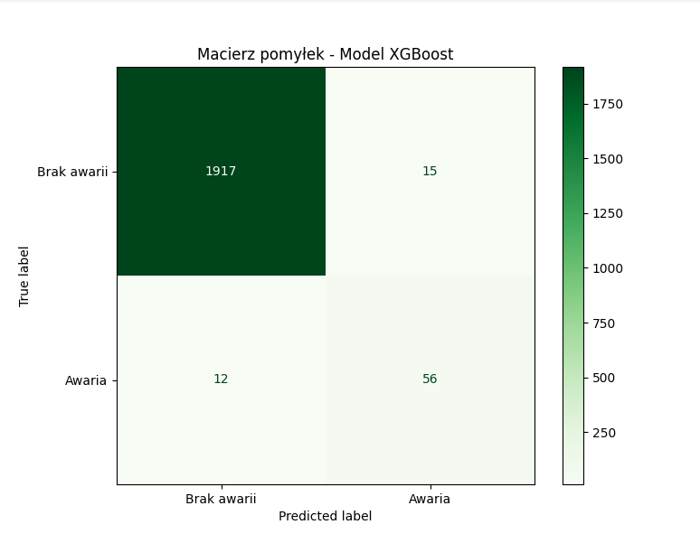
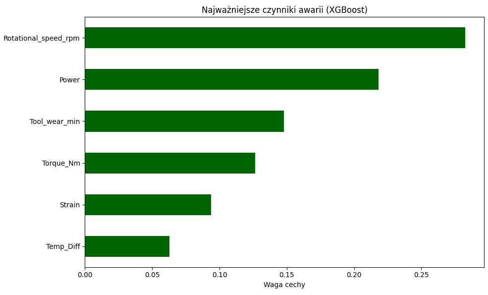

# Predictive Maintenance for Automated Brewery Bottling Line

## 1. Project Overview
This project demonstrates the implementation of a Machine Learning-based Predictive Maintenance (PdM) system for an automated brewery bottling line. The primary goal is to shift from reactive maintenance (fixing after failure) to a proactive approach, significantly reducing unplanned downtime and product loss.

The project utilizes the **AI4I 2020 Predictive Maintenance Dataset** to simulate industrial sensor data from bottling machines (cappers, fillers, and labelers).

## 2. Business Context (Brewery Operations)
In a high-speed bottling environment, a single component failure can lead to:
*   **Massive Product Waste**: Spilled beer and discarded glass.
*   **High Downtime Costs**: Production halts during peak demand.
*   **Secondary Damage**: A seized bearing in a capper can damage the entire carousel.

This model provides an early-warning system to trigger maintenance interventions before a catastrophic failure occurs.

## 3. Evolutionary Development & Methodology

### Phase 1: Baseline Model (Random Forest)
*   **Approach**: Initial classification using standard Random Forest.
*   **Observation**: The model suffered from extreme class imbalance (failures accounted for only ~3.4% of data).
*   **Result**: High accuracy but low Recall for failures (many breakdowns were missed).

### Phase 2: Domain-Driven Feature Engineering
To improve predictive power, we introduced physical engineering metrics:
*   **Mechanical Power**: Calculated as the product of Torque and Rotational Speed ($P = \tau \cdot \omega$).
*   **Temperature Differential (Temp_Diff)**: Difference between process and ambient temperature, indicating cooling efficiency.
*   **Mechanical Strain**: Interaction between Torque and Tool Wear, acting as a proxy for cumulative material fatigue.

### Phase 3: Handling Class Imbalance (XGBoost & Cost-Sensitive Learning)
*   **Final Choice**: **XGBoost** (Extreme Gradient Boosting).
*   **Optimization**: Instead of synthetic oversampling (SMOTE), we utilized **Scale_pos_weight** (Cost-Sensitive Learning). This prioritized the minority "Failure" class during training without distorting the data distribution.

## 4. Final Model Performance
The final XGBoost model achieved a superior balance between sensitivity and reliability:

| Metric | Score | Interpretation |
| :--- | :--- | :--- |
| **Accuracy** | 99% | Overall correctness across all states. |
| **Recall (Sensitivity)** | **82%** | **8 out of 10 failures are successfully predicted.** |
| **Precision** | **79%** | **4 out of 5 alarms are genuine**, minimizing false inspections. |
| **F1-Score** | 0.81 | Strong harmonic mean for the failure class. |

## 5. Key Predictive Factors
Analysis of **Feature Importance** revealed that the most critical indicators of an upcoming failure are:
1.  **Rotational Speed (RPM)**: Sudden fluctuations in carousel speed.
2.  **Mechanical Power**: Excessive energy consumption relative to speed.
3.  **Mechanical Strain**: The combined effect of component wear and physical load.

## 6. Project Structure
*   `main.py`: The final optimized XGBoost pipeline.
*   `ai4i2020.csv`: Raw dataset.
*   `requirements.txt`: Environment dependencies.

---